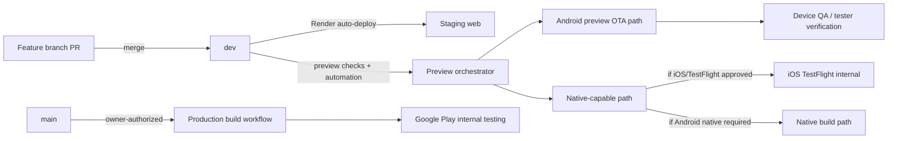

# 1. System overview

This handbook captures the current delivery architecture for Zentric-Analytics/Kurioticket.com as a documentation-only record.

## Evidence taxonomy

- **REPOSITORY_VERIFIED**: verified from checked-in repo files and scripts.
- **HISTORICALLY_VERIFIED**: verified through prior approved PR/operational evidence.
- **EXTERNAL_VERIFIED**: verified against Render/EAS/Google Play/App Store Connect evidence in this task scope.

## Current delivery posture

| Surface | Identity | Runtime/Channel | Distribution | Delivery control | Evidence |
|---|---|---|---|---|---|
| Web staging | `kurioticket.com-staging` | N/A | Render auto-deploy from `dev` | Team merge to `dev` triggers deployment | EXTERNAL_VERIFIED |
| Web production | `kurioticket.com` | N/A | Render auto-deploy from `main` | Main changes deploy on push | REPOSITORY_VERIFIED |
| Android Preview | `Kurioticket Preview` / `com.kurioticket.app.preview` | `preview-0.3.0` / `preview` | OTA + native build when required | PR workflow + preview classifier | HISTORICALLY_VERIFIED |
| Android Production | `Kurioticket` / `com.kurioticket.app` | `production-0.3.0` / `production` | Google Play AAB | Owner-dispatched, manual step | EXTERNAL_VERIFIED |
| iOS Preview | `Kurioticket Preview` / `com.kurioticket.app.preview` | `preview-0.3.0` / `preview` | TestFlight internal | Team/owner runbook + verified submission path | EXTERNAL_VERIFIED |
| iOS Production | Not active | N/A | N/A | Not configured in current delivery automation | DEFERRED |

## Architecture shape

## External verification levels used in this phase

Web staging and mobile identities are marked as repository, historical, or external verified where evidence exists.
- iOS TestFlight verification includes prior successful submission/build evidence and current external workflow posture.
