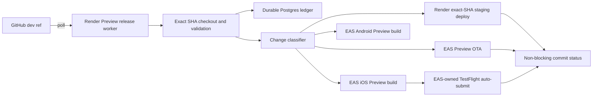

# Independent Preview Release Service

Status: proposed replacement, dry-run first. Production delivery is out of scope.

## Ownership

After cutover, `kurioticket-preview-release` is the single owner of Preview delivery. It polls `dev` every 60 seconds and does not depend on GitHub webhooks or GitHub Actions. A merge to `dev` is the Preview authorization; no second approval is requested.

## Trust boundaries

The worker accepts only `Zentric-Analytics/Kurioticket.com`, branch `dev`, full immutable SHAs, and these fixed Preview values:

- App: `Kurioticket Preview`
- Bundle: `com.kurioticket.app.preview`
- Scheme: `kurioticket-preview`
- Project: `89f6fd88-c0d7-495a-9e2b-8301b09f407d`
- Build/submit profile and channel: `preview`
- Runtime: `preview-0.3.0`
- API: `https://staging.kurioticket.com`

Any uncertain mobile change or production-like identity fails closed. The worker receives Preview-only credentials and a Render API key scoped to staging. It never receives Production delivery credentials.

## Ledger and locks

`preview_release` has one row per source SHA. An atomic lease permits one worker to process it, survives worker restarts, and can be recovered only after expiry. `preview_release_action` has unique identity keys and partial unique indexes for one web deploy, OTA publication, platform build, and submission relationship. Remote IDs are written immediately after the corresponding API accepts an operation; a conflicting remote ID is rejected.

State flow:

`DETECTED -> VALIDATING -> PLANNED -> DELIVERING -> COMPLETE`

Failures enter `FAILED` with the original safe error and recovery action. `SUPERSEDED` is reserved for work that has not created a remote operation. Once EAS accepts a native build, that build remains durable and is monitored instead of replaced.

## Classification

- Web paths trigger exact-SHA Render staging.
- JavaScript-only mobile paths can trigger Preview OTA only when both Expo native fingerprints equal the last completed baseline.
- App configuration, native dependencies/projects, icons, splash, permissions, plugins, fonts, and lockfiles require native delivery.
- Platform-specific native paths target their platform.
- Unknown mobile paths fail closed.
- Documentation-only changes require no delivery.

## Exact-SHA delivery

The poller reads the Git ref through authenticated GitHub REST, compares the prior completed SHA to the new SHA, and performs a detached exact-SHA checkout. Render receives `commitId` and the final deployment must attest the same SHA. EAS history is filtered and then validated locally by project, platform, profile, SHA, and app identity before creating anything.

## Retry and recovery

API reads use bounded exponential backoff. Mutation calls are protected by the ledger uniqueness constraints and remote reconciliation. API errors and malformed responses are never treated as empty history. The worker does not use an in-memory lock as its authority.

iOS build creation uses `--no-wait --auto-submit-with-profile preview`; Android uses `--no-wait`. Build IDs are stored immediately and restarts adopt an exact SHA/project/platform/profile match. The worker does not issue a second TestFlight submission when auto-submit is created, in progress, or finished. Unknown or conflicting submission state fails closed.

## Cutover

1. Deploy the worker with `PREVIEW_RELEASE_MODE=dry-run` and provision its dedicated Postgres database.
2. Configure Preview-only secrets and prove polling, exact checkout, classification, reconciliation, and ledger writes without mutation.
3. Merge the replacement that removes every legacy Preview delivery workflow and caller.
4. Verify the old workflows are absent from `dev` and no required rule references them.
5. Change only `PREVIEW_RELEASE_MODE` to `active` and record the current `dev` SHA as the initial baseline.
6. Prove web, OTA, and native/TestFlight paths once each.

There must never be two active Preview delivery owners.

## Rollback

Set `PREVIEW_RELEASE_MODE=dry-run` to pause mutations while preserving polling and ledger evidence. Fix and redeploy the worker, then resume from stored remote IDs. Do not restore legacy GitHub Actions delivery without separate owner approval.

## Operations

Each cycle emits structured, secret-redacted logs. Polling uses a read-only GitHub token. A separately scoped optional token may write the non-required commit status `kurioticket/preview-release`; without it, the ledger and Render logs remain authoritative. Visual verification reports include the exact SHA and the applicable Render deployment, EAS Update, EAS build, and TestFlight state.
